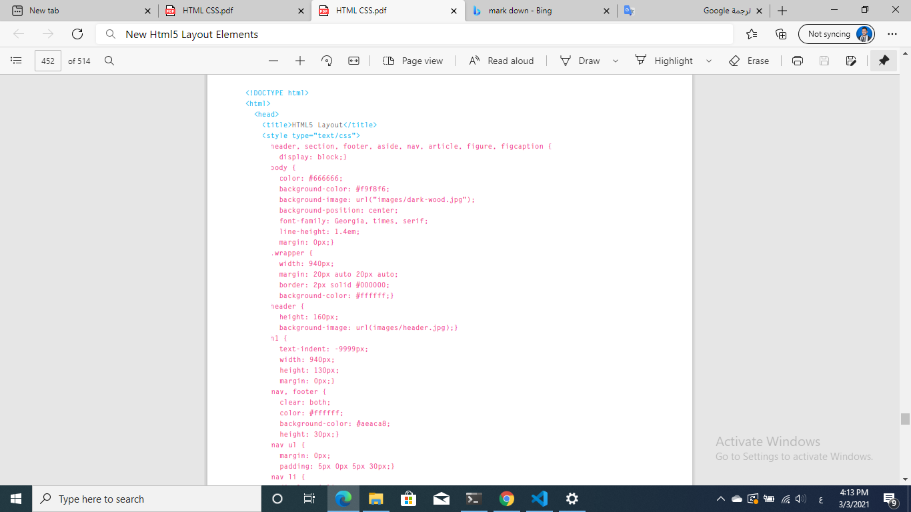
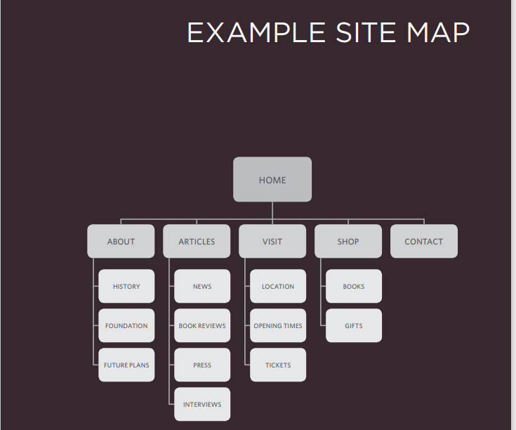

# HTML5 
## HTML5
 is introducing a new set of
elements that help define the structure of
a page.

They are covered here (rather than with the other HTML
elements you met earlier in the book) because you'll find
it easier to understand how they can be used now that you
have seen how CSS can control the layout a page. These
new elements are going to play an important part in creating 
layouts going forward. In this chapter you will see:
1.  The new HTML5 layout elements and their uses
2.  How they offer helpful alternatives to the  element
3. How to ensure older browsers recognize these elements

## Traditional HTML Layouts
For a long time, web page authors used  elements to group
together related elements on the page (such as the elements that form a
header, an article, footer or sidebar). Authors used class or id attributes
to indicate the role of the element in the structure of the page.

## New Html5 Layout Elements
HTML5 introduces a new set of elements that allow you to divide up the
parts of a page. The names of these elements indicate the kind of content
you will find in them. They are still subject to change, but that has not
stopped many web page authors using them already

## We'll take some examples :
### 1. Headers & Footers 
The header and footer
elements can be used for:

● The main header or footer
that appears at the top or
bottom of every page on the
site.

● A header or footer for an
individual article or
section within the page

### 2. Navigation
The nav element is used to
contain the major navigational
blocks on the site such as the
primary site navigation.
Going back to our blog example,
if you wanted to finish an article
with links to related blog posts,
these would not be counted as
major navigational blocks and
therefore should not sit inside a
nav element.

### 3. Articles
The article element acts as
a container for any section of a
page that could stand alone and
potentially be syndicated.
This could be an individual
article or blog entry, a comment
or forum post, or any other
independent piece of content.
 

 ### There are many other examples 
 ## Example 

## Process & Design 
Every website should be designed for the
target audience—not just for yourself or the
site owner. It is therefore very important to
understand who your target audience is

|Name      | age |     Gender     | 
| ----------- | ----------- | ---- |
| ahmad    | 28       |male| 
| aya   | 29       | female | 
 
 If you have a question about how
the site is going to be used, or
what its priorities should be, you 
will be able to think back and ask
yourself, "What would ahmad
or aya want in this situation?

## What Your Visitors are Trying to Achieve? 
It is unlikely that you will be able to list every
reason why someone visits your site but you
are looking for key tasks and motivations. This
information can help guide your site designs. 

ahmad  bought a tennis racquet several years ago; now he wants to
purchase one from your site for his girlfriend. 

aya  is a picture editor and wants to look at a photographer's site to see
examples of his work before deciding whether to commission her.

## How Often People Will Visit Your Site ? 
Some sites benefit from being updated more
frequently than others. Some information (such
as news) may be constantly changing, while
other content remains relatively static.

## Exam for site
 
